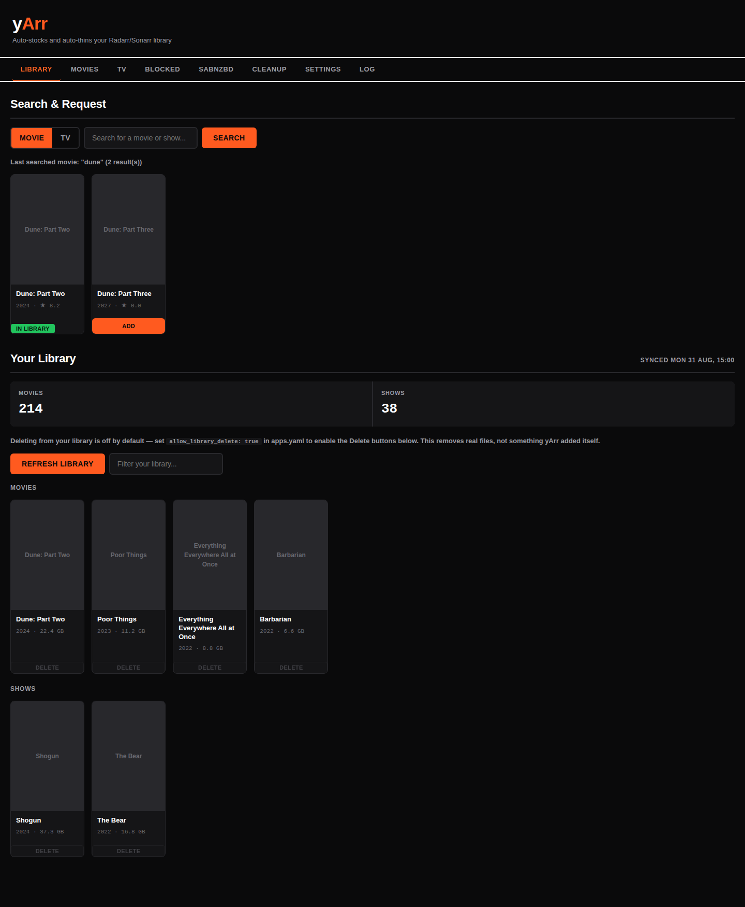
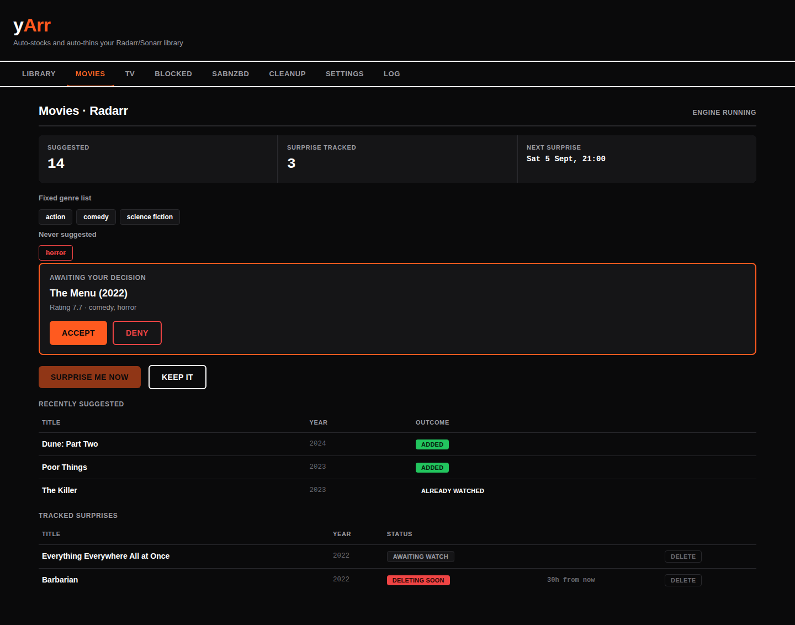
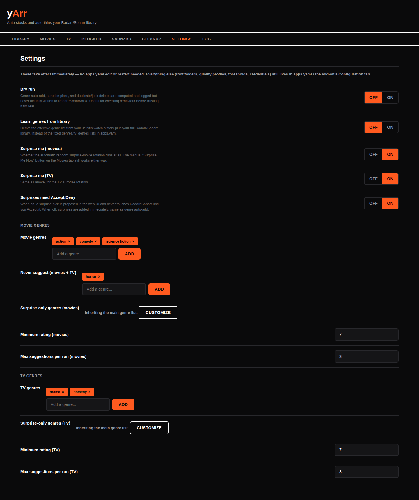
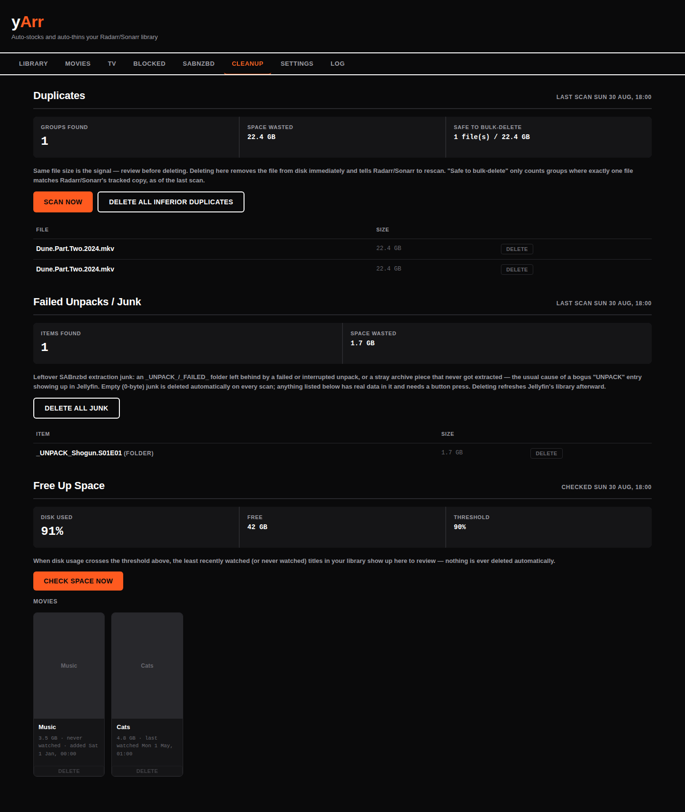

# yArr

A Home Assistant add-on that automatically discovers, surprises you with,
and cleans up your movie/TV library across TMDB, Radarr, Sonarr, and
Jellyfin — with optional SABnzbd queue monitoring. Bundles its own
AppDaemon runtime, so there's nothing else to install.

## What it does

- **Genre auto-add** — periodically pulls TMDB picks filtered by your
  favourite genres and a minimum rating, skipping anything already
  watched, already in your library, or already suggested, and adds
  good matches straight to Radarr/Sonarr.
- **Learn your taste (optional)** — instead of a hand-typed genre list,
  derive a weighted profile from what you've actually watched in
  Jellyfin blended with what's already in your library.
- **Surprise me** — a random pick on a jittered cadence, proposed for
  Accept/Deny in the web UI (or added outright, your choice) — plus a
  manual button if you don't want to wait.
- **Watch it, lose it** — an accepted surprise gets deleted after a
  grace period once you've watched it, with a notification and a
  "keep it instead" option. Never touches your regular library.
- **Deny it, block it** — denying a surprise blocks that exact title
  everywhere, permanently, until you unblock it — no silent genre
  blacklisting from a couple of denials.

- **Full library browser + request hub** — search TMDB for anything and
  add it with one click, or browse/manage your entire existing
  Radarr/Sonarr library, not just what yArr itself suggested.
- **Settings tab** — genre lists, rating thresholds, on/off switches,
  all live-editable in the web UI. No `apps.yaml` edit or restart.

- **NAS cleanup (optional)** — finds duplicate files by size and
  leftover failed-unpack junk on your media share, with per-file or
  bulk delete.
- **Free up space (optional)** — once your disk crosses a usage
  threshold, lists the least-recently-watched titles in your library
  for you to review and delete — never automatic.

Full feature list and configuration reference: [yarr_addon/README.md](yarr_addon/README.md)
· detailed setup/behaviour docs: [yarr_addon/DOCS.md](yarr_addon/DOCS.md)

## Install

Home Assistant → Settings → Add-ons → Add-on Store → ⋮ → **Repositories**
→ add `https://github.com/james-autho-tech/yarr` → find "yArr" → Install.

See [yarr_addon/README.md](yarr_addon/README.md#install) for the full
setup steps (required API keys, Jellyfin webhook, etc.).
